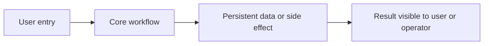

# Project Onboarding

Status: active
Audience: a developer or coding agent seeing this repository for the first time

## 1. One-Line Summary

Describe what this repository does, who uses it, and the main business or product outcome it supports.

## 2. System Flow

Use a short diagram or numbered flow to show the core product path.



## 3. Tech Stack

| Area | Technology | Where to look |
|---|---|---|
| App/runtime | Project framework and runtime | `package.json`, app entry points |
| Data | Database, ORM, migrations | schema and migration folders |
| Auth | Session, token, role model | auth library and middleware |
| UI | Component and styling system | component and style folders |
| Deploy | Build, image, infrastructure, CI | deployment and IaC files |

## 4. First Files To Read

| Priority | File | Why it matters |
|---|---|---|
| 1 | `README.md` | Local setup and project intent |
| 2 | `package.json` or equivalent | Scripts and dependencies |
| 3 | Main app entry | Request routing and layout |
| 4 | Data schema | Domain model and constraints |
| 5 | Auth/session code | Access control and user identity |
| 6 | Test or QA docs | Verification expectations |
| 7 | Deployment docs | Operational assumptions |

## 5. Directory Structure

```text
.
├── src/ or app/       # application source
├── tests/            # automated tests when present
├── docs/             # repo-local documentation
├── scripts/          # setup, verification, maintenance scripts
├── infrastructure/   # deployment or IaC when present
└── kyle/             # shared vault symlink, not committed
```

Adjust this tree to the actual repository after inspection.

## 6. User And Permission Model

List roles, permissions, and protected surfaces. Include both UI-level gates and API/server-level checks.

| Role | Meaning | Access |
|---|---|---|
| user | Default user | Main product surface |
| admin | Operator or administrator | Administrative surface |

## 7. Data Model

Summarize the primary tables, collections, or resources. Mention invariants enforced by the database or persistence layer.

## 8. Critical Flows

Document the workflows that are most expensive to break:

1. New user or account creation.
2. Main user workflow.
3. Admin or operator workflow.
4. Background jobs, webhooks, or scheduled work.
5. Deployment and rollback path.

## 9. Local Development

```bash
# install dependencies
# start required local services
# run migrations or seed data
# start the app
```

Include required environment variables, local ports, and service dependencies. In Conductor, prefer `CONDUCTOR_PORT` for app servers.

## 10. Verification

List the checks that prove common changes are safe:

```bash
git diff --check
npm test
npm run lint
npm run typecheck
```

Replace commands with the project’s real checks.

## 11. Known Risks

- High-risk files or modules.
- Race conditions, data-loss risks, security-sensitive paths.
- Manual verification still required.

## 12. Agent Notes

- Start from `kyle/AGENT_ENTRY.md`.
- Follow `kyle/06-ops/vault-foldering-rules.md` for new vault documents.
- Append work state to `kyle/06-ops/agent-live-log.json` when present.
